<!-- @summary
Multi-modal RAG platform with pipeline-first ingestion, visual+text embeddings,
and graph-based orchestration. Includes engineering docs, onboarding guides, and
operations tooling for observability, backup/restore, and scaling.
@end-summary -->

<p align="center">
  
</p>

**RagWeave** is a production-grade, multi-modal Retrieval-Augmented Generation platform. It ingests documents of any format, builds dual-track text and visual embeddings, and serves grounded answers through a full retrieval-reranking-generation pipeline — with guardrails, observability, and confidence routing built in.

### What It Does

- **Ingests anything** — PDFs, DOCX, PPTX, HTML, Markdown, images, tables, and code. A 13-node LangGraph pipeline handles parsing (via Docling), structure detection, VLM figure captioning, text cleaning, semantic chunking, metadata extraction, knowledge graph triples, and quality validation.
- **Dual-track embeddings** — Text chunks are embedded with BGE-M3 (1024-dim dense vectors). Document pages are visually embedded with ColQwen2 (128-dim patch vectors via a 4-bit quantized Qwen2-VL backbone). Both tracks are stored in Weaviate and searched simultaneously at query time.
- **Hybrid retrieval + reranking** — Combines BM25 keyword search with dense vector search (configurable alpha blend), expands queries with knowledge graph terms, reranks with a BGE cross-encoder, and merges visual page results via ColQwen2 MaxSim scoring.
- **Confidence-aware generation** — A 3-signal composite score (retrieval confidence, LLM self-assessment, citation coverage) routes each answer to RETURN, RE_RETRIEVE, FLAG, or BLOCK — no silent hallucinations.
- **Full safety rails** — Input guardrails (intent classification, injection/jailbreak detection, PII redaction, toxicity filtering, topic safety) and output guardrails (faithfulness checking, hallucination detection) run in parallel with per-rail timeouts.
- **Provider-agnostic LLMs** — LiteLLM Router with named aliases (`default`, `vision`, `query`, `smart`, `fast`). Swap between Ollama, OpenAI, Anthropic, or any OpenAI-compatible endpoint via config alone.
- **Temporal orchestration** — Both ingestion and query serving run as durable Temporal workflows with independent retry policies. Workers scale horizontally.
- **Observability built in** — Langfuse LLM tracing, Prometheus metrics, Grafana dashboards, per-stage timing budgets, and token budget tracking per request.

### Key Strengths

| Strength | Detail |
|----------|--------|
| **True multi-modal** | Not just text — visual page embeddings let you search diagrams, charts, and layouts that text extraction misses |
| **Pipeline-first** | Every stage is a discrete LangGraph node with its own config toggle — add, skip, or replace any stage without touching the rest |
| **Swappable backends** | Abstract base classes for vector store, document store, guardrails, observability, and retry — implement the ABC, add one config branch |
| **Runs anywhere** | Local with Ollama + embedded Weaviate, or fully containerized with Docker/Podman profiles for app, workers, monitoring, and HTTPS gateway |
| **Battle-tested safety** | Defense-in-depth: regex + NeMo + LLM semantic classification for injection detection; Presidio + GLiNER for PII; claim-level hallucination scoring |
| **Multi-tenant ready** | JWT + API key auth, per-tenant Redis conversation memory with sliding window + rolling summary, rate limiting and quotas |

## Quick Start

### Prerequisites

- **Python 3.10+** (3.12 recommended)
- **[uv](https://docs.astral.sh/uv/)** — fast Python package manager
- **Node.js 18+** and **npm** — for the web console TypeScript build
- **Docker** and **Docker Compose** (or **Podman** and **podman-compose**) — for infrastructure services (Temporal, Redis)
- **[Ollama](https://ollama.com/)** — for local LLM inference (or set `RAG_LLM_*` vars for cloud providers)

> **Podman users**: Podman is supported as a drop-in replacement for Docker.
> See [Podman Setup](#podman-setup) below for one-time configuration.

### 1. Clone and set up the project

```bash
git clone <repo-url> && cd RAG
make setup
```

`make setup` runs the full one-shot: creates `.venv/`, installs all runtime + dev dependencies via `uv`, installs web-console npm deps, and compiles the TypeScript console. Run once per clone.

> Prefer explicit steps? `make install` does just the Python deps; `make console-install && make console-build` handles the console. Or skip `make` entirely:
> `uv venv && uv pip install -e ".[dev]"`, or `python -m venv .venv && source .venv/bin/activate && pip install -e ".[dev]"`.

#### Optional dependency groups

Some features require extra packages that are not installed by default:

```bash
uv pip install -e ".[pii]"          # PII detection (presidio, spacy)
uv pip install -e ".[gliner]"       # GLiNER entity extraction
uv pip install -e ".[chromadb]"     # ChromaDB vector store
uv pip install -e ".[pinecone]"     # Pinecone vector store
uv pip install -e ".[qdrant]"       # Qdrant vector store
uv pip install -e ".[all]"          # All optional dependencies
```

### 2. Web console (already built by `make setup`)

`make setup` already installs and compiles the web console. You only need these targets when iterating on the TypeScript source:

```bash
make console-watch   # rebuild on change (live dev)
make console-check   # type-check only, no emit
make console-build   # one-shot production build
```

### 3. Start infrastructure services

```bash
./scripts/compose.sh --profile temporal up -d
```

This starts the core services: **Temporal** (orchestration) + **Temporal UI** (port 8080).
The `compose.sh` wrapper auto-detects Docker or Podman — no configuration needed.

Redis starts automatically when you use the `app` or `workers` profiles (see below).

### 4. Configure environment

```bash
cp .env.example .env
```

RagWeave will not start correctly without the three steps below. Everything else has a working default.

---

#### Step A — Download embedding and reranker models

The worker loads BGE models from your local filesystem — they are not bundled in the image.
Download them anywhere you like, then tell RagWeave where they are via `RAG_MODEL_ROOT`.

**1. Download the models** (pick one):

```bash
# huggingface-cli (recommended)
pip install huggingface-hub
huggingface-cli download BAAI/bge-m3 --local-dir ~/models/baai/bge-m3
huggingface-cli download BAAI/bge-reranker-v2-m3 --local-dir ~/models/baai/bge-reranker-v2-m3

# git-lfs
git lfs install
git clone https://huggingface.co/BAAI/bge-m3 ~/models/baai/bge-m3
git clone https://huggingface.co/BAAI/bge-reranker-v2-m3 ~/models/baai/bge-reranker-v2-m3
```

**2. Point `RAG_MODEL_ROOT` at the parent directory** (pick one):

```bash
# Option A — set the env var directly in .env (works anywhere):
RAG_MODEL_ROOT=/home/you/models

# Option B — symlink so the default (./models) resolves correctly:
ln -s ~/models <repo>/models
# then leave RAG_MODEL_ROOT=./models in .env (the default)
```

Expected layout inside `$RAG_MODEL_ROOT`:

```
$RAG_MODEL_ROOT/
  baai/
    bge-m3/               ← embedding model (~570 MB)
    bge-reranker-v2-m3/   ← reranker model (~570 MB)
```

> **Sharing models across projects?** Keep them in one place (e.g. `~/models`) and point each project at them via `RAG_MODEL_ROOT` or a symlink. No duplication needed.

> **Using vLLM instead?** Skip this step entirely — set `RAG_INFERENCE_BACKEND=vllm` and vLLM pulls Qwen3 weights from HuggingFace Hub automatically. See [Step D](#step-d--optional-switch-to-vllm-inference-backend).

---

#### Step B — Set up your LLM

**Option 1 — Local (Ollama, default):**

```bash
# Ollama must be installed and running: https://ollama.com
ollama pull qwen2.5:3b        # generation model (required)
```

No further `.env` changes needed — the defaults point at `localhost:11434`.

**Option 2 — Cloud provider (OpenRouter, OpenAI, Anthropic, etc.):**

```bash
# In .env:
RAG_LLM_MODEL=openrouter/anthropic/claude-3-haiku   # LiteLLM model string
RAG_LLM_API_BASE=https://openrouter.ai/api/v1
RAG_LLM_API_KEY=sk-or-v1-...
```

LiteLLM model strings follow the pattern `<provider>/<model-name>`. See [LiteLLM docs](https://docs.litellm.ai/docs/providers) for the full list.

---

#### Step C — (Optional) tune behaviour

These have working defaults but are worth reviewing before production use:

| Variable | Default | Notes |
|----------|---------|-------|
| `RAG_LLM_TEMPERATURE` | `0.3` | Generation temperature |
| `RAG_LLM_MAX_TOKENS` | `1024` | Max tokens per response |
| `RAG_CACHE_TTL_SECONDS` | `120` | Query result cache lifetime |
| `RAG_RATE_LIMIT_REQUESTS_PER_MINUTE` | `60` | Per-tenant rate limit |
| `RAG_MEMORY_MAX_RECENT_TURNS` | `8` | Conversation history window |
| `RAG_RETRIEVAL_TIMEOUT_MS` | `30000` | End-to-end query timeout |

See [.env.example](.env.example) for all available settings.

---

#### Step D — (Optional) switch to vLLM inference backend

By default, embeddings and reranking run **in-process** inside `rag-worker` using the BGE models from Step A. This works for local dev but loads ~3–4 GB of weights into the worker process and is slow on CPU.

**vLLM mode** offloads inference to two dedicated containers (`rag-vllm-embed` and `rag-vllm-rerank`) running Qwen3 models, routed through LiteLLM. The worker becomes a lean HTTP coordinator and inference scales independently.

```bash
# 1. Start inference containers (requires Docker + ~1.2 GB HuggingFace download)
./scripts/compose.sh --profile inference up -d

# 2. Pre-warm Qwen3 model caches (first time only)
make vllm-pull-models

# 3. Verify both containers are healthy
make container-probe-vllm

# 4. In .env — switch the worker to vLLM mode:
RAG_INFERENCE_BACKEND=vllm

# 5. Restart the worker
make restart-worker
```

**CPU vs GPU model selection** (set in `.env`):

| Profile | `RAG_VLLM_EMBEDDING_MODEL` | `RAG_VLLM_RERANKER_MODEL` | Notes |
|---------|---------------------------|--------------------------|-------|
| CPU / WSL2 (default) | `Qwen/Qwen3-Embedding-0.6B` | `Qwen/Qwen3-Reranker-0.6B` | ~0.6 GB each |
| GPU (NVIDIA) | `Qwen/Qwen3-Embedding-4B` | `Qwen/Qwen3-Reranker-4B` | ~4 GB each, fp16 |

See the GPU profile comments in `.env.example` for the exact vars to uncomment.

To revert to local BGE models: set `RAG_INFERENCE_BACKEND=local` and `make restart-worker`.

---

> **After changing `.env`:** most settings are read at startup. For changes to take effect in the containerised stack, run `make restart-worker` (worker config) or restart the API container. Generation model changes (e.g. switching Ollama model) only require a worker restart. Embedding or reranker model path changes require `make restart-worker` and confirming the new model files are mounted.

### 6. Run

```bash
# Activate the virtual environment
source .venv/bin/activate

# Ingest documents
python -m src.ingest.cli --dir ./documents

# Query locally (no server needed)
python query.py "What is RAG?"

# Or use the interactive CLI
python cli.py
```

## Running the API Server

### Option A — Local dev (fast iteration, no Docker rebuild)

```bash
# Terminal 1: Start infrastructure
./scripts/compose.sh up -d
./scripts/compose.sh --profile app up -d rag-redis

# Terminal 2: Start API server
uv run uvicorn server.api:app --host 0.0.0.0 --port 8000

# Terminal 3: Start Temporal worker (optional — needed for ingestion/query workflows)
uv run python -m server.worker
```

> **WSL2 users:** if inter-container networking is broken after a WSL2 restart, run
> `sudo ./scripts/fix-docker-networking.sh` once, or set up the automatic fix in
> `/etc/wsl.conf` — see [WSL2 Setup](#wsl2-setup) below.

### Option B — Fully containerised stack

```bash
# Start infrastructure + API + workers in containers
./scripts/restart_stack.sh --app --workers

# After code changes, rebuild + restart:
make restart        # app + workers
make restart-all    # all profiles (monitoring, gateway, etc.)

# Scale workers horizontally:
./scripts/compose.sh --profile workers up -d --scale rag-worker=3
```

Then use the CLI client or web console:

```bash
# CLI client (targets the API server)
python -m server.cli_client

# User Console (chat):  open http://localhost:8000/console
# Admin Console (ops):  open http://localhost:8000/console/admin
```

### Expose publicly via Cloudflare Tunnel (no account needed)

```bash
cloudflared tunnel --url http://localhost:8000
# Prints a public https://*.trycloudflare.com URL — share it with anyone.
# Kill with Ctrl+C when done.
```

## Running Tests

```bash
make test                          # full suite (uv run pytest)

# Fast static gates (no test execution). Pick one depending on scope:
make precommit-check               # runs L1+L2+L3+L4+TS on git-tracked files (skips WIP)
make all-check                     # same, but over the full tree including untracked

# Individual layers:
make py-compile-check              # L1: compileall across source tree
make import-check-tracked          # L2 (tracked files only)
make import-check                  # L2 (full tree)
make dep-check                     # L3: deptry
make container-dep-check           # L4: requirements-*.txt in sync with pyproject.toml

# Targeted pytest invocations still work directly:
source .venv/bin/activate
pytest tests/ingest/ -v            # ingestion tests only
```

> Neither `precommit-check` nor `all-check` runs the pytest suite — they're fast static gates. Run `make test` separately. **Use `precommit-check` before every `git commit`** so in-progress untracked work doesn't block your commit. **Use `all-check` before releases or as a periodic hygiene sweep** to catch issues in WIP code you haven't committed yet. L4 (`container-dep-check`) catches missing or misplaced deps across `pyproject.toml` and the two container requirements files.

## Container Profiles

Two services have no profile and start whenever compose is invoked:

| Container | Image | Size |
|-----------|-------|------|
| `rag-postgres` | `postgres:16-alpine` | 395 MB |
| `rag-minio` | `minio/minio:latest` | 241 MB |

All other services are profile-gated:

| Profile | Use Case | Key containers | Third-party images | Approx. pull |
|---------|----------|----------------|--------------------|--------------|
| `temporal` | Temporal orchestration engine + UI | `rag-temporal-db`, `rag-temporal`, `rag-temporal-ui` | `postgres:16-alpine`¹, `temporalio/auto-setup`, `temporalio/ui` | +1.24 GB |
| `app` | Containerized API server | `rag-api`², `rag-nginx`, `rag-redis`, `pg-maintenance` | `nginx:alpine`, `redis:7-alpine`, `postgres:16-alpine`¹ | +544 MB |
| `workers` | Containerized ingest/query workers | `rag-worker`² | `redis:7-alpine`¹ | +5.79 GB |
| `monitoring` | Prometheus + Grafana + Dozzle | `rag-prometheus`, `rag-alertmanager`, `rag-grafana`, `rag-monitor` | `prom/prometheus`, `prom/alertmanager`, `grafana/grafana`, `amir20/dozzle` | +1.74 GB |
| `observability` | Langfuse LLM tracing (full stack) | `rag-langfuse-*` (6 containers) | `postgres:17`, `redis:7`, `clickhouse/clickhouse-server`, `cgr.dev/chainguard/minio`, `langfuse/langfuse-worker:3`, `langfuse/langfuse:3` | +5.93 GB |
| `gateway` | nginx HTTPS reverse proxy | `rag-nginx` | `nginx:alpine`¹ | +94 MB |

¹ Shared image — no additional pull if already present from another profile.  
² Custom-built locally — see [Container Images](#container-images).

```bash
# Example: full production stack with monitoring
./scripts/compose.sh --profile temporal --profile app --profile workers --profile monitoring up -d
```

## Container Images

The stack uses two images with strict dependency isolation:

| Image | Size | Contents |
|---|---|---|
| `rag-api` | 389 MB | FastAPI, Temporal client, Weaviate client — no torch, no docling, no ML stack |
| `rag-worker` | 5.79 GB | Full ML stack (torch, sentence-transformers, docling, langchain, nemoguardrails) |

Dependencies live in `containers/requirements-api.txt` and `containers/requirements-worker.txt` — **not** in `pyproject.toml`. This is deliberate: `pip install .` would install every dep listed under `[project.dependencies]`, which undoes the isolation. Local dev still uses `pyproject.toml` via `make install`; containers bypass it.

**Adding a new dependency:**
- If the API server imports it → add to `pyproject.toml` AND `containers/requirements-api.txt`
- If only the worker uses it → add to `pyproject.toml` AND `containers/requirements-worker.txt`
- Dev-only (pytest, deptry, etc.) → `pyproject.toml` only

### Build the images

**With make (recommended):**

```bash
make container-build          # build both with docker (BuildKit)
make container-build-podman   # build both with podman (preferred for production)
make container-probe          # run API import probe — catches transitive ML leakage
make container-sizes          # show current image sizes
make container-clean          # remove local rag-api / rag-worker images
```

**Manual Docker:**

```bash
DOCKER_BUILDKIT=1 docker build -t rag-api    -f containers/Dockerfile.api .
DOCKER_BUILDKIT=1 docker build -t rag-worker -f containers/Dockerfile.runtime .
```

**Manual Podman:**

```bash
# --format docker preserves HEALTHCHECK directives if ever re-added to the Dockerfile
podman build --format docker -t rag-api    -f containers/Dockerfile.api .
podman build --format docker -t rag-worker -f containers/Dockerfile.runtime .
```

### Architecture notes

- **Multi-stage builds** — `build-essential` (gcc et al) lives in the builder stage only; the runtime stage copies just the installed `site-packages`. Saves ~170 MB per image.
- **BuildKit pip cache mounts** — `RUN --mount=type=cache,target=/root/.cache/pip` persists pip's wheel cache across rebuilds. Does not affect final image size but dramatically speeds up dep-change rebuilds (e.g. bumping torch version).
- **`.dockerignore`** — excludes `.venv/`, `tests/`, `evals/`, `docs/`, `node_modules/`, etc. Fully-cached rebuilds take ~1.5 seconds.
- **HEALTHCHECK lives in `docker-compose.yml`**, not in the Dockerfile — podman's default OCI image format drops `HEALTHCHECK` directives, and compose-level healthchecks work identically under both docker-compose and podman-compose.
- **Source code is on `PYTHONPATH=/app`**, so there's no `pip install .` step. Changing source doesn't invalidate the dep layer.
- **GPU inference is supported** in the worker image — full torch with bundled CUDA libs. To enable on the host: set `gpus: all` under `rag-worker` in `docker-compose.yml` and ensure the NVIDIA container runtime is installed.

Full optimization history (9-iteration auto-research run): [`docs/operations/DOCKER_OPTIMIZATION.md`](docs/operations/DOCKER_OPTIMIZATION.md)

## HTTPS Gateway (nginx)

Add HTTPS support in front of the API server using nginx:

### One-time setup

```bash
# 1. Install mkcert
sudo apt install mkcert          # Debian/Ubuntu
# brew install mkcert             # macOS

# 2. Generate locally-trusted certs
./scripts/generate-certs.sh

# 3. Add hostname to /etc/hosts
echo "127.0.0.1  aion.local" | sudo tee -a /etc/hosts
```

### Start with HTTPS

```bash
./scripts/compose.sh --profile temporal --profile app --profile gateway up -d
# Browse: https://aion.local
```

The `gateway` profile requires the `app` profile. See `certs/README.md` for details.

> **Security note:** When the gateway is active, port 8000 remains directly accessible (bypassing TLS). For LAN demos, set `RAG_API_HOST_PORT=127.0.0.1:8000` in `.env` to restrict direct access to localhost only.

### Internet access (Cloudflare Tunnel)

For demos on a different network, use [Cloudflare Tunnel](https://developers.cloudflare.com/cloudflare-one/connections/connect-networks/) (free, no account needed) to get a public HTTPS URL:

```bash
# Install (one-time)
sudo apt install cloudflared          # Debian/Ubuntu
# brew install cloudflared             # macOS

# Point tunnel at the API server (local dev)
cloudflared tunnel --url http://localhost:8000

# Or point at nginx gateway (containerised stack with TLS)
cloudflared tunnel --url https://localhost:443 --no-tls-verify
```

This prints a public URL like `https://random-name.trycloudflare.com` — share it with anyone. Kill with Ctrl+C when done.

## WSL2 Setup

Docker bridge networking on WSL2 requires a one-time fix per WSL2 session (iptables FORWARD rules are reset when WSL2 restarts). To make it automatic, add a boot command to `/etc/wsl.conf`:

```ini
# /etc/wsl.conf  (create if it doesn't exist)
[boot]
command = "service docker start && iptables -P FORWARD ACCEPT"
```

After saving, restart WSL2 from PowerShell:

```powershell
wsl --shutdown
```

From that point on, Docker inter-container networking will work automatically on every WSL2 startup. No manual steps needed when cloning the repo on a new WSL2 machine.

**Manual fix (current session only):**

```bash
sudo ./scripts/fix-docker-networking.sh
```

The script is WSL2-aware — it no-ops on Linux and macOS.

## Podman Setup

Podman is supported as a rootless, daemonless alternative to Docker. One-time setup:

```bash
# 1. Install Podman
sudo apt-get install -y podman podman-compose   # Debian/Ubuntu

# 2. Enable user socket (needed for Dozzle log viewer)
systemctl --user enable --now podman.socket

# 3. Verify rootless mode
podman info | grep -i rootless   # should show: rootless: true

# 4. Set the container socket in .env
echo "CONTAINER_SOCK=\$XDG_RUNTIME_DIR/podman/podman.sock" >> .env

# 5. Use compose.sh as normal — it auto-detects Podman
./scripts/compose.sh --profile temporal --profile app up -d
```

See `docs/operations/PODMAN_SPEC.md` for full details.


## Overview

This repository contains:

- A modular **13-node ingestion workflow** (`src/ingest/`) for document-to-vector/KG processing
- A **retrieval and query-serving runtime** (`src/retrieval/`, `server/`) with Temporal orchestration
- Tenant-aware **conversation memory** (Redis-backed) with sliding-window + rolling-summary context management
- **Platform modules** for auth, limits, observability, and caching (`src/platform/`)
- **LiteLLM SDK integration** for provider-agnostic LLM access (Ollama, OpenAI, Anthropic, etc.)
- Operations and architecture documentation (`docs/`)

### Architecture (Runtime)

```text
Users/CLI -> FastAPI (server/api.py) -> Temporal workflow -> Worker activity
                                                    |
                                                    v
                                          RAGChain singleton
                                  (retrieval, reranking, optional generation)
```

Ingestion runs separately and writes processed content/embeddings consumed by retrieval.

### Ingestion Source Identity

The ingestion pipeline uses stable source identity metadata instead of filename-only matching:

- `source_key`: stable ingestion identity for manifest and update cleanup.
- `source_id`: immutable connector-native document identifier.
- `source_uri`: canonical source location used for retrieval trace-back.

## Directory Map

| Directory | Purpose |
| --- | --- |
| `src/common/` | Cross-domain deterministic helpers reused across ingestion/retrieval features |
| `src/ingest/` | Modular ingestion pipeline (node-per-file, shared helpers, LangGraph workflow) |
| `src/retrieval/` | Query processing, retrieval orchestration, reranking, and generation |
| `src/platform/` | Cross-cutting platform services: auth, quotas/rate limits, cache, metrics, observability |
| `server/` | FastAPI/Temporal runtime: API, workflows, activities, worker, schemas, and CLI client |
| `config/` | Central environment-driven settings (`config/settings.py`) |
| `docs/` | Engineering guides, specs, operations runbooks, onboarding checklists |
| `tests/` | Unit/integration tests, including ingestion-focused tests in `tests/ingest/` |
| `scripts/` | Ops helpers (backup/restore, DR drill, tuning signal watcher, smoke test) |
| `prompts/` | Prompt templates for retrieval query processing |

## Entry Points

| Command | Description |
|---------|-------------|
| `python ingest.py --dir ./documents` | CLI for ingestion runs |
| `python query.py "question"` | Local retrieval query CLI |
| `python cli.py [query\|ingest]` | Unified interactive CLI |
| `python -m server.worker` | Temporal worker process |
| `uvicorn server.api:app --host 0.0.0.0 --port 8000` | API server |
| `python -m server.cli_client` | Interactive client targeting the API server |
| `python -m server.mcp_adapter` | MCP tooling adapter over the API (`stdio` transport) |

## Make Targets

Run `make help` for this list in the terminal. All targets are also documented in comments in the [Makefile](Makefile) itself.

| Target | Purpose |
|---|---|
| **Setup & install** | |
| `make setup` | **First-time setup.** Creates venv, installs Python deps, runs `npm install`, builds the web console |
| `make install` | (Re)install Python deps into the active env (`uv pip install -e ".[dev]"`) |
| **Web console (TypeScript)** | |
| `make console-install` | `npm install` for the web console |
| `make console-check` | TypeScript type-check (no emit) |
| `make console-build` | Compile TS → `static/main.js` |
| `make console-watch` | Watch mode — rebuild on TS change |
| **Checks & tests** | |
| `make test` | Run the pytest suite |
| `make py-compile-check` | L1 syntax: `compileall` across `src/`, `server/`, `config/`, `import_check/` |
| `make import-check` | L2 internal: resolve imports + encapsulation, **whole tree** (includes untracked) |
| `make import-check-tracked` | L2 internal but only for **git-tracked** files (for `precommit-check`) |
| `make dep-check` | L3 external: `deptry` — `pyproject.toml` vs actual imports |
| `make container-dep-check` | L4 container: `requirements-*.txt` in sync with `pyproject.toml` |
| `make precommit-check` | **Compound gate for `git commit`**: L1 + L2(tracked) + L3 + L4 + `npm ci` + console-check. Excludes untracked WIP. |
| `make all-check` | **Compound gate for release**: same checks but over the entire tree including untracked. |
| **Container images** (see [Container Images](#container-images) for details) | |
| `make container-build` | Compile frontend + build `rag-api` + `rag-worker` with docker (BuildKit) |
| `make container-build-api` | Build only `rag-api` |
| `make container-build-worker` | Build only `rag-worker` |
| `make container-build-podman` | Compile frontend + build both with podman (`--format docker`) |
| `make container-probe` | Run the API import probe inside `rag-api` — catches transitive ML leakage |
| `make container-sizes` | Print current `rag-api` / `rag-worker` image sizes |
| `make container-clean` | Remove local `rag-api` / `rag-worker` images + dangling images |
| `make smoke-test` | Full integration check: build + stack + cloudflared tunnel + API checks + teardown |
| `make container-build-and-test` | Build images then immediately run smoke test (`SKIP_BUILD=1`) |
| **Stack restart** (uses `scripts/restart_stack.sh` — auto-detects docker/podman) | |
| `make restart` | Compile frontend + restart `app` + `workers` profiles with rebuild |
| `make restart-all` | Compile frontend + restart all profiles with rebuild |

## Engineering Docs

| Directory | Contents |
|-----------|----------|
| `docs/ingestion/` | Ingestion pipeline spec (split: pipeline nodes + platform/cross-cutting), implementation guide, engineering guide, onboarding checklist |
| `docs/retrieval/` | Retrieval pipeline specs (split: query/ranking + generation/safety), NeMo Guardrails, engineering guide, onboarding checklist |
| `docs/server/` | Server API spec + implementation, platform services spec (auth, tenancy, rate limits, caching) |
| `docs/ui/` | CLI spec + implementation, web console spec + implementation, token budget spec + implementation |
| `docs/performance/` | Retrieval performance spec (runtime controls, benchmarking, load testing) |
| `docs/operations/` | Operations platform spec (deployment, scaling, monitoring, DR, CI/CD), 100-user plan, Podman migration |
| `docs/llm/` | LiteLLM SDK integration guide |

Key starting points:
- Ingestion: `docs/ingestion/INGESTION_PIPELINE_ENGINEERING_GUIDE.md`
- Retrieval: `docs/retrieval/RETRIEVAL_ENGINEERING_GUIDE.md`
- Server/runtime: `server/README.md`

## License

See [LICENSE](LICENSE) for details.
